# GiveToGrow Web Application - Project Changes Report

**Project Name:** GiveToGrow - School Donation Platform  
**Report Date:** November 30, 2025  
**Live Site:** http://169.239.251.102:442/~akua.oduro  

---

## Table of Contents
1. [Project Overview](#project-overview)
2. [System Analysis and Design](#system-analysis-and-design)
3. [System Architecture](#system-architecture)
4. [Database Schema](#database-schema)
5. [Functional Requirements](#functional-requirements)
6. [Non-Functional Requirements](#non-functional-requirements)
7. [Technical Changes & Bug Fixes](#technical-changes--bug-fixes)
8. [File Structure](#file-structure)
9. [Security Implementations](#security-implementations)
10. [Payment Integration](#payment-integration)
11. [Admin System](#admin-system)
12. [Clean Code Practices](#clean-code-practices)

---

## 1. Project Overview

GiveToGrow is a web-based e-commerce donation platform that connects donors with schools in need across Ghana. The platform allows users to browse schools, view their specific needs, and make donations through a secure payment gateway.

### Core Functionality
- **School Management:** Admin can add, edit, and manage schools
- **Needs Management:** Admin can add, edit, and delete school needs/items
- **Shopping Cart:** Users can add donation items to cart
- **Payment Processing:** Integrated Paystack payment gateway (GHS currency)
- **Impact Tracking:** Donors can view their donation history and impact
- **User Authentication:** Separate roles for customers and administrators

---

## 2. System Analysis and Design

### 2.1 Tools and Technologies Used

| Tool/Technology | Purpose |
|-----------------|---------|
| **PHP 7.4+** | Server-side scripting language for backend logic |
| **MySQL (MariaDB)** | Relational database for data storage |
| **TailwindCSS** | Utility-first CSS framework for responsive design |
| **JavaScript** | Client-side interactivity and AJAX requests |
| **Paystack API** | Payment gateway integration for Ghana (GHS) |
| **SweetAlert2** | Beautiful alert dialogs and notifications |
| **Apache Server** | Web server (MAMP locally, Linux production) |
| **Git** | Version control system |

### 2.2 System Design

#### Use Case Diagram

```mermaid
flowchart TB
    subgraph Actors
        C[👤 Customer/Donor]
        A[👨‍💼 Administrator]
    end
    
    subgraph Customer Actions
        C --> UC1[Register Account]
        C --> UC2[Login/Logout]
        C --> UC3[Browse Schools]
        C --> UC4[View School Details]
        C --> UC5[Add to Cart]
        C --> UC6[Checkout & Pay]
        C --> UC7[View Donation History]
        C --> UC8[Download Receipt]
    end
    
    subgraph Admin Actions
        A --> UA1[Manage Schools - CRUD]
        A --> UA2[Manage Needs - CRUD]
        A --> UA3[View Dashboard Statistics]
        A --> UA4[Post Updates to Donors]
    end
```



#### User Flow Diagram

```mermaid
flowchart LR
    subgraph Customer Journey
        A[🏠 Landing Page] --> B{Logged In?}
        B -->|No| C[📝 Register/Login]
        C --> D[🏫 Browse Schools]
        B -->|Yes| D
        D --> E[📋 School Details]
        E --> F[🛒 Add to Cart]
        F --> G[💳 Checkout]
        G --> H[💰 Paystack Payment]
        H --> I{Payment Success?}
        I -->|Yes| J[✅ Donation Success]
        I -->|No| K[❌ Payment Failed]
        J --> L[📊 View Impact]
        K --> G
    end
```




#### Entity Relationship Diagram (ERD)


#### System Architecture Diagram

```mermaid
flowchart TB
    subgraph Client Layer
        WB[🌐 Web Browser]
        MB[📱 Mobile Browser]
    end
    
    subgraph Presentation Layer
        WB --> HTML[HTML5 Views]
        MB --> HTML
        HTML --> TW[TailwindCSS]
        HTML --> JS[JavaScript]
        JS --> SA[SweetAlert2]
    end
    
    subgraph Application Layer
        HTML --> PHP[PHP 7.4+ Backend]
        PHP --> AUTH[Authentication Module]
        PHP --> CART[Cart Module]
        PHP --> PAY[Payment Module]
        PHP --> ADMIN[Admin Module]
    end
    
    subgraph Data Layer
        PHP --> DB[(MySQL Database)]
        DB --> USERS[(Users Table)]
        DB --> SCHOOLS[(Schools Table)]
        DB --> NEEDS[(School Needs Table)]
        DB --> DONATIONS[(Donations Table)]
        DB --> CARTS[(Cart Table)]
    end
    
    subgraph External Services
        PAY --> PS[💳 Paystack API]
    end
```



#### Payment Flow Sequence Diagram

```mermaid
sequenceDiagram
    participant U as 👤 User
    participant C as 🛒 Cart Page
    participant S as 🖥️ Server (PHP)
    participant P as 💳 Paystack API
    participant DB as 🗄️ Database
    
    U->>C: Click "Proceed to Checkout"
    C->>S: POST /checkout.php
    S->>S: Calculate Total
    S->>P: Initialize Transaction
    P-->>S: Return Authorization URL
    S-->>U: Redirect to Paystack
    U->>P: Complete Payment
    P->>S: Callback with Reference
    S->>P: Verify Transaction
    P-->>S: Payment Status
    alt Payment Successful
        S->>DB: Insert Donations
        S->>DB: Update School Amount Raised
        S->>DB: Clear User Cart
        S-->>U: Redirect to Success Page
    else Payment Failed
        S-->>U: Redirect to Error Page
    end
```



#### Class Diagram


---

## 3. System Architecture

### Technology Stack
| Component | Technology |
|-----------|------------|
| Backend | PHP 7.4+ |
| Database | MySQL (MariaDB) |
| Frontend | HTML5, TailwindCSS, JavaScript |
| Payment Gateway | Paystack API |
| Notifications | SweetAlert2 |
| Server | Apache (MAMP locally, Linux server for production) |

### Architecture Pattern
The application follows an **MVC-like pattern**:
- **Models:** `/models/` - Database interaction logic
- **Views:** `/views/` - User-facing pages
- **Controllers:** `/controllers/` - Business logic
- **Actions:** `/actions/` - Form handlers and API endpoints

---

## 4. Database Schema

### Tables Structure

#### `users` Table
```sql
- user_id (INT, PRIMARY KEY, AUTO_INCREMENT)
- user_name (VARCHAR 100)
- user_email (VARCHAR 100, UNIQUE)
- user_password (VARCHAR 255, hashed)
- user_role (ENUM: 'customer', 'admin')
- created_at (TIMESTAMP)
```

#### `schools` Table
```sql
- school_id (INT, PRIMARY KEY, AUTO_INCREMENT)
- school_name (VARCHAR 200)
- location (VARCHAR 200)
- country (VARCHAR 100)
- description (TEXT)
- image_url (VARCHAR 500)
- total_students (INT)
- fundraising_goal (DECIMAL 10,2)
- amount_raised (DECIMAL 10,2)
- is_verified (BOOLEAN)
- status (ENUM: 'active', 'inactive')
- created_at, updated_at (TIMESTAMPS)
```

#### `school_needs` Table
```sql
- need_id (INT, PRIMARY KEY, AUTO_INCREMENT)
- school_id (INT, FOREIGN KEY)
- item_name (VARCHAR 200)
- item_description (TEXT)
- item_category (ENUM: 'Books', 'TextBooks', 'Technology', 'Furniture', 
                 'Sports Equipment', 'Art Supplies', 'Laboratory Equipment',
                 'Musical Instruments', 'School Supplies', 'Infrastructure',
                 'Uniforms', 'Clothes', 'Desks', 'Library Resources', 'Computers')
- unit_price (DECIMAL 10,2)
- quantity_needed (INT)
- quantity_donated (INT, DEFAULT 0)
- image_url (VARCHAR 500)
- priority (ENUM: 'low', 'medium', 'high', 'urgent')
- status (ENUM: 'active', 'fulfilled', 'inactive')
- created_at, updated_at (TIMESTAMPS)
```

#### `cart` Table
```sql
- cart_id (INT, PRIMARY KEY, AUTO_INCREMENT)
- user_id (INT, FOREIGN KEY)
- need_id (INT, FOREIGN KEY)
- quantity (INT)
- created_at (TIMESTAMP)
```

#### `donations` Table
```sql
- donation_id (INT, PRIMARY KEY, AUTO_INCREMENT)
- user_id (INT, FOREIGN KEY)
- need_id (INT, FOREIGN KEY)
- school_id (INT, FOREIGN KEY)
- quantity (INT)
- amount (DECIMAL 10,2)
- payment_reference (VARCHAR 100)
- payment_status (ENUM: 'pending', 'completed', 'failed')
- transaction_date (TIMESTAMP)
```

---

## 5. Functional Requirements

This section demonstrates how each functional requirement is implemented in the GiveToGrow platform.

### 5.1 User Registration, Login/Logout, Authentication ✓

| Requirement | Implementation | Files |
|-------------|----------------|-------|
| User Registration | Users can create accounts with name, email, password | `/login/register.php`, `/actions/register_customer.php` |
| User Login | Email/password authentication with session management | `/login/login.php`, `/actions/login_customer.php` |
| User Logout | Session destruction and redirect | `/actions/logout.php` |
| Role-Based Access | Separate customer and admin roles | `/settings/admin_check.php` |
| Password Security | Bcrypt hashing with `password_hash()` | `/actions/register_customer.php` |

**Code Example - User Registration:**
```php
// Password hashing for security
$hashed_password = password_hash($password, PASSWORD_DEFAULT);

// Insert user with role
$query = "INSERT INTO users (user_name, user_email, user_password, user_role) VALUES (?, ?, ?, 'customer')";
$stmt->bind_param('sss', $name, $email, $hashed_password);
```

**Code Example - Login Authentication:**
```php
// Verify password and create session
if (password_verify($password, $user['user_password'])) {
    $_SESSION['user_id'] = $user['user_id'];
    $_SESSION['user_name'] = $user['user_name'];
    $_SESSION['user_role'] = $user['user_role'];
}
```

### 5.2 Product/Service Search and Filtering ✓

| Requirement | Implementation | Files |
|-------------|----------------|-------|
| Browse All Schools | Display all active schools with details | `/views/schools.php` |
| School Categories | Schools organized by location/region | `/views/schools.php` |
| Need Categories | Filter needs by category (Books, Technology, etc.) | `/admin/manage_needs.php` |
| Search by School | View specific school and its needs | `/views/school_detail.php` |
| Priority Filtering | Needs sorted by priority (urgent, high, medium, low) | Database queries |

**Code Example - Fetching Schools with Needs:**
```php
// Query to get schools with their primary need
$schools_query = "
    SELECT s.*, sn.item_category, sn.item_name
    FROM schools s
    LEFT JOIN school_needs sn ON s.school_id = sn.school_id
    WHERE s.status = 'active'
    ORDER BY s.created_at DESC
";
```

### 5.3 Shopping Cart Management ✓

| Requirement | Implementation | Files |
|-------------|----------------|-------|
| Add to Cart | Add donation items with quantity | `/actions/add_to_cart.php` |
| View Cart | Display all cart items with totals | `/views/cart.php` |
| Update Quantity | Adjust item quantities in cart | `/actions/update_cart.php` |
| Remove Items | Delete items from cart | `/actions/update_cart.php` |
| Cart Persistence | Cart stored in database per user | `cart` table |
| Cart Count | Real-time cart item count display | `/actions/get_cart_count.php` |

**Code Example - Add to Cart:**
```php
// Check if item already in cart
$check_query = "SELECT * FROM cart WHERE user_id = ? AND need_id = ?";
$existing = $db->db_fetch_one($check_query, [$user_id, $need_id]);

if ($existing) {
    // Update quantity
    $update_query = "UPDATE cart SET quantity = quantity + ? WHERE cart_id = ?";
} else {
    // Insert new item
    $insert_query = "INSERT INTO cart (user_id, need_id, quantity) VALUES (?, ?, ?)";
}
```

**Code Example - Cart Display:**
```php
// Fetch cart items with need details
$cart_query = "
    SELECT c.*, sn.item_name, sn.unit_price, sn.image_url, s.school_name
    FROM cart c
    JOIN school_needs sn ON c.need_id = sn.need_id
    JOIN schools s ON sn.school_id = s.school_id
    WHERE c.user_id = ?
";
```

### 5.4 Customer Order/Request Management & Invoicing ✓

| Requirement | Implementation | Files |
|-------------|----------------|-------|
| Order Processing | Donations recorded with all details | `/actions/paystack_verify_payment.php` |
| Order History | View all past donations | `/views/my_impact.php` |
| Order Details | Individual donation records with items | `donations` table |
| Receipt Generation | Print-to-PDF receipt functionality | `/views/donation_success.php` |
| Transaction Tracking | Payment reference and status tracking | `donations` table |

**Code Example - Recording Donation:**
```php
// Insert donation record for each cart item
$donation_query = "
    INSERT INTO donations (user_id, need_id, school_id, quantity, amount, payment_reference, payment_status, transaction_date)
    VALUES (?, ?, ?, ?, ?, ?, 'completed', NOW())
";
$stmt->bind_param('iiiids', $user_id, $need_id, $school_id, $quantity, $amount, $reference);
```

**Code Example - Receipt Download:**
```javascript
// Print-to-PDF receipt functionality
function downloadReceipt() {
    window.print();
}
```

### 5.5 Payment Platform Integration and Payment Processing ✓

| Requirement | Implementation | Files |
|-------------|----------------|-------|
| Payment Gateway | Paystack API integration | `/settings/paystack_config.php` |
| Currency Support | Ghana Cedis (GHS) | All payment files |
| Transaction Init | Initialize payment with Paystack | `/actions/paystack_init_transaction.php` |
| Payment Verification | Verify payment status via API | `/actions/paystack_verify_payment.php` |
| Callback Handling | Process payment result | `/views/paystack_callback.php` |
| Success Confirmation | Display donation confirmation | `/views/donation_success.php` |

**Code Example - Initialize Paystack Payment:**
```php
// Initialize Paystack transaction
$fields = [
    'email' => $user_email,
    'amount' => $total_amount * 100, // Convert to kobo/pesewas
    'currency' => 'GHS',
    'callback_url' => APP_BASE_URL . '/views/paystack_callback.php',
    'reference' => $reference
];

$ch = curl_init();
curl_setopt($ch, CURLOPT_URL, "https://api.paystack.co/transaction/initialize");
curl_setopt($ch, CURLOPT_HTTPHEADER, [
    "Authorization: Bearer " . PAYSTACK_SECRET_KEY,
    "Content-Type: application/json"
]);
curl_setopt($ch, CURLOPT_POSTFIELDS, json_encode($fields));
```

**Code Example - Verify Payment:**
```php
// Verify payment with Paystack API
$ch = curl_init();
curl_setopt($ch, CURLOPT_URL, "https://api.paystack.co/transaction/verify/" . $reference);
curl_setopt($ch, CURLOPT_HTTPHEADER, [
    "Authorization: Bearer " . PAYSTACK_SECRET_KEY
]);
$response = curl_exec($ch);
$result = json_decode($response, true);

if ($result['data']['status'] === 'success') {
    // Record donations and clear cart
}
```

---

## 6. Non-Functional Requirements

### 6.1 Modern Design and Appealing Interface ✓

| Requirement | Implementation |
|-------------|----------------|
| **Responsive Design** | TailwindCSS with mobile-first approach |
| **Modern UI Components** | Cards, modals, progress bars, badges |
| **Consistent Color Scheme** | Primary green (#A4B8A4), clean backgrounds |
| **Typography** | Lexend font family for readability |
| **Icons** | Material Symbols Outlined for visual cues |
| **Animations** | Hover effects, transitions, loading states |
| **Dark Mode Support** | CSS classes for dark theme compatibility |

**Design Features:**
- Hero sections with background images
- Card-based layouts for schools and needs
- Progress bars showing fundraising goals
- SweetAlert2 for beautiful notifications
- Sticky headers for easy navigation
- Mobile-responsive hamburger menu

### 6.2 User-Friendly Platform with Ease of Navigation ✓

| Feature | Implementation |
|---------|----------------|
| **Clear Navigation** | Top navigation bar with main sections |
| **Breadcrumb Trail** | Back buttons on detail pages |
| **Visual Feedback** | Loading states, success/error messages |
| **Intuitive Cart** | Floating cart icon with item count |
| **Quick Actions** | "Add to Cart" and "Donate Now" buttons |
| **Dashboard** | Personalized homepage for logged-in users |
| **Impact Tracking** | Easy access to donation history |

**User Experience Features:**
- One-click "Add to Cart" functionality
- Clear pricing in Ghana Cedis (₵)
- Visual progress towards school fundraising goals
- Confirmation modals before actions
- Success pages with clear next steps
- Mobile-optimized touch targets

---

## 7. Technical Changes & Bug Fixes

### 5.1 Form Submission Fixes

#### Issue: Add School Need Form Returning 302 Error
**Problem:** Form submission failed with redirect error  
**Cause:** `bind_param` type mismatch in `/actions/admin_add_need.php`  
**Solution:** Corrected type string from `isssdiis` to `isssdiss`

```php
// BEFORE (incorrect)
$stmt->bind_param('isssdiis', ...);

// AFTER (correct)
$stmt->bind_param('isssdiss', 
    $school_id,      // i = integer
    $item_name,      // s = string
    $item_description, // s = string
    $item_category,  // s = string
    $unit_price,     // d = double
    $quantity_needed, // i = integer
    $image_url,      // s = string (was incorrectly 'i')
    $priority        // s = string
);
```

#### Issue: Category ENUM Mismatch
**Problem:** Form categories didn't match database ENUM values  
**Solution:** Updated form `<option>` values to match exact database ENUM values

### 5.2 Image Upload System

#### Original Approach: Cloudinary Widget
**Problem:** Cloudinary upload widget was unreliable, saving "0" instead of URLs  
**Cause:** Widget callback issues with server-side handling

#### New Approach: Direct URL Input
**Solution:** Replaced Cloudinary widget with simple URL text input
- Admin pastes image URL directly
- Preview function validates image loads correctly
- URL stored as string in database

**Files Modified:**
- `/admin/add_need.php` - Complete rewrite of image handling
- `/admin/manage_needs.php` - Updated edit functionality

### 5.3 Payment Integration Fixes

#### Issue: Paystack Callback URL Incorrect
**Problem:** Callback pointed to localhost instead of live server  
**File:** `/settings/paystack_config.php`

```php
// BEFORE
define('APP_BASE_URL', 'http://localhost:8888/GiveToGrow_Web');

// AFTER
define('APP_BASE_URL', 'http://169.239.251.102:442/~akua.oduro');
```

#### Issue: Processing Fee Confusion
**Problem:** Cart showed processing fee that wasn't being charged  
**Solution:** Removed processing fee display from cart summary

**File:** `/views/cart.php`
```php
// Removed processing fee calculation
// Now shows only: Subtotal → Total
```

### 5.4 Donation Success Page Fix

#### Issue: Only One Item Shown After Multi-Item Purchase
**Problem:** Success page displayed only the last donated item  
**Cause:** Query fetched single donation by ID instead of all from transaction

**Solution:** Updated query to fetch all donations from same transaction

**File:** `/views/donation_success.php`
```php
// BEFORE
$donation = $db->db_fetch_one("SELECT * FROM donations WHERE donation_id = ?", [$donation_id]);

// AFTER
$donations = $db->db_fetch_all(
    "SELECT d.*, sn.item_name, sn.image_url, s.school_name 
     FROM donations d 
     JOIN school_needs sn ON d.need_id = sn.need_id 
     JOIN schools s ON d.school_id = s.school_id 
     WHERE d.user_id = ? AND DATE(d.transaction_date) = DATE(?) 
     ORDER BY d.donation_id DESC",
    [$user_id, $transaction_date]
);
```

### 5.5 Currency Standardization

#### Issue: Mixed Currency Symbols
**Problem:** Some pages showed `$` instead of `₵` (Ghana Cedis)  
**Solution:** Updated all currency displays to use `₵` symbol

**Files Modified:**
- `/views/cart.php`
- `/views/checkout.php`
- `/views/donation_success.php`
- `/views/school_detail.php`
- `/views/schools.php`
- `/views/index.php`
- `/views/my_impact.php`
- `/views/dashboard.php`
- `/admin/dashboard.php`

### 5.6 User Registration Role Fix

#### Issue: New Users Automatically Became Admins
**Problem:** Registration defaulted to admin role  
**File:** `/actions/register_customer.php`

```php
// Verified correct - role is set to 'customer'
$role = 'customer';
```

**Note:** The code was already correct. Issue may have been with existing database records.

### 5.7 Admin Dashboard Improvements

#### Issue: Dashboard Showing Limited Schools
**Problem:** Only displayed 5 most recent schools  
**Solution:** Removed LIMIT clause to show all schools

**File:** `/admin/dashboard.php`
```php
// BEFORE
$recent_schools = $db->db_fetch_all("SELECT * FROM schools ORDER BY created_at DESC LIMIT 5");

// AFTER
$recent_schools = $db->db_fetch_all("SELECT * FROM schools ORDER BY created_at DESC");
```

### 5.8 UI/UX Fixes

#### Issue: False Error Popup on Page Load
**Problem:** "Image Error" SweetAlert appeared after successful form submission  
**Cause:** Inline `onerror` handler fired when image element had empty `src`

**Solution:** Moved error handling to JavaScript function, only triggers during active preview

---

## 8. File Structure

```
GiveToGrow_Web/
├── index.php                 # Entry point (redirects to views/index.php)
├── test_db.php              # Database connection tester
│
├── actions/                  # Form handlers & API endpoints
│   ├── add_to_cart.php
│   ├── admin_add_need.php   # ✓ Fixed bind_param types
│   ├── admin_add_school.php
│   ├── delete_school.php
│   ├── get_cart_count.php
│   ├── login_customer.php
│   ├── logout.php
│   ├── paystack_init_transaction.php
│   ├── paystack_verify_payment.php
│   ├── process_payment.php
│   ├── register_customer.php
│   ├── send_update_notifications.php
│   ├── update_cart.php
│   ├── update_need.php      # ✓ Created for edit functionality
│   └── delete_need.php      # ✓ Created for delete functionality
│
├── admin/                    # Admin panel pages
│   ├── dashboard.php        # ✓ Fixed to show all schools
│   ├── add_school.php
│   ├── manage_schools.php
│   ├── add_need.php         # ✓ Rewrote image handling
│   ├── manage_needs.php     # ✓ Created new file
│   ├── post_update.php
│   └── add_impact_metric.php
│
├── assets/
│   └── images/              # Local image assets
│
├── controllers/
│   └── customer_controller.php
│
├── db/                       # Database schemas & migrations
│   ├── schools_schema.sql
│   ├── impact_tracking_schema.sql
│   ├── create_admin_user.sql
│   └── [various fix scripts]
│
├── js/                       # JavaScript files
│
├── login/
│   ├── login.php
│   └── register.php
│
├── models/
│   └── customer_model.php
│
├── settings/                 # Configuration files
│   ├── admin_check.php
│   ├── cloudinary_config.php
│   ├── core.php
│   ├── db_class.php
│   ├── db_cred.php
│   └── paystack_config.php  # ✓ Updated callback URL
│
└── views/                    # Public-facing pages
    ├── index.php
    ├── schools.php          # ✓ Currency symbol fix
    ├── school_detail.php    # ✓ Currency symbol fix
    ├── cart.php             # ✓ Removed processing fee
    ├── checkout.php         # ✓ Currency symbol fix
    ├── donation_success.php # ✓ Fixed multi-item display, added receipt download
    ├── my_impact.php        # ✓ Currency symbol fix, shows school updates
    ├── dashboard.php        # ✓ Shows impact updates section
    ├── about.php
    ├── donate_item.php
    └── paystack_callback.php
```

---

## 9. Security Implementations

### 7.1 Password Security
- Passwords hashed using PHP's `password_hash()` with bcrypt
- Password verification using `password_verify()`

### 7.2 SQL Injection Prevention
- Prepared statements used throughout the application
- Parameter binding for all user inputs

### 7.3 Session Management
- Session-based authentication
- Role-based access control (customer vs admin)
- Admin routes protected with session checks

### 7.4 Input Validation
- Server-side validation for all form inputs
- Email format validation
- Required field checks

### 7.5 XSS Prevention
- `htmlspecialchars()` used for output escaping
- User inputs sanitized before display

---

## 10. Payment Integration

### Paystack Configuration
- **Currency:** GHS (Ghana Cedis)
- **Mode:** Live/Test configurable
- **Callback URL:** `http://169.239.251.102:442/~akua.oduro/views/paystack_callback.php`

### Payment Flow
1. User adds items to cart
2. User proceeds to checkout
3. System initializes Paystack transaction
4. User completes payment on Paystack
5. Paystack redirects to callback URL
6. System verifies payment with Paystack API
7. On success: donations recorded, cart cleared
8. User redirected to success page

### Transaction Recording
- Each cart item creates separate donation record
- All items share same `transaction_date` for grouping
- Payment reference stored for reconciliation

---

## 11. Admin System

### Admin Access
- Admin accounts created manually in database
- Role must be set to 'admin' in users table
- Admin check performed via `/settings/admin_check.php`

### Admin Capabilities
| Action | Description |
|--------|-------------|
| View Dashboard | See statistics and all schools |
| Add School | Create new school with details and image |
| Edit School | Modify school information |
| Delete School | Remove school from system |
| Add Need | Create donation items for schools |
| Edit Need | Modify need details and images |
| Delete Need | Remove needs from system |
| Post Updates | Send updates to donors |

### Statistics Tracked
- Total Schools (all / active)
- Total Needs (all / active)
- Total Amount Raised

---

## 12. Clean Code Practices

### 12.1 Comments ✓

Code is documented with meaningful comments explaining functionality:

```php
// Check if user is logged in before accessing protected pages
if (!isset($_SESSION['user_id'])) {
    header("Location: ../login/login.php");
    exit();
}

// Fetch cart items with associated need and school details
$cart_query = "
    SELECT c.*, sn.item_name, sn.unit_price, sn.image_url, s.school_name
    FROM cart c
    JOIN school_needs sn ON c.need_id = sn.need_id
    JOIN schools s ON sn.school_id = s.school_id
    WHERE c.user_id = ?
";

// Calculate progress percentage (cap at 100%)
$progress = min(100, ($school['amount_raised'] / $school['fundraising_goal']) * 100);
```

### 12.2 Use of Functions and Classes ✓

**Database Class (`/settings/db_class.php`):**
```php
class db_connection {
    private $conn;
    
    // Establish database connection
    public function db_connect() { ... }
    
    // Execute SELECT query and return single row
    public function db_fetch_one($query, $params = []) { ... }
    
    // Execute SELECT query and return all rows
    public function db_fetch_all($query, $params = []) { ... }
    
    // Execute INSERT/UPDATE/DELETE query
    public function db_query($query, $params = []) { ... }
}
```

**Reusable Functions:**
```php
// Format currency display
function formatCurrency($amount) {
    return '₵' . number_format($amount, 2);
}

// Calculate time ago for updates
function timeAgo($datetime) {
    $time_ago = time() - strtotime($datetime);
    if ($time_ago < 3600) {
        return floor($time_ago / 60) . ' minutes ago';
    } elseif ($time_ago < 86400) {
        return floor($time_ago / 3600) . ' hours ago';
    } else {
        return floor($time_ago / 86400) . ' days ago';
    }
}
```

**JavaScript Functions:**
```javascript
// Add item to cart via AJAX
function addToCart(needId) {
    fetch('../actions/add_to_cart.php', {
        method: 'POST',
        headers: { 'Content-Type': 'application/x-www-form-urlencoded' },
        body: 'need_id=' + needId + '&quantity=1'
    })
    .then(response => response.json())
    .then(data => {
        if (data.success) {
            showAddToCartModal();
        }
    });
}

// Preview image before form submission
function previewImage(url) {
    const preview = document.getElementById('imagePreview');
    preview.src = url;
    preview.classList.remove('hidden');
}
```

### 12.3 Indentation ✓

Consistent 4-space indentation throughout all files:

```php
<?php
class db_connection {
    private $conn;
    
    public function db_connect() {
        $this->conn = new mysqli(DB_HOST, DB_USER, DB_PASS, DB_NAME);
        
        if ($this->conn->connect_error) {
            die("Connection failed: " . $this->conn->connect_error);
        }
        
        return $this->conn;
    }
    
    public function db_fetch_all($query, $params = []) {
        $conn = $this->db_connect();
        $stmt = $conn->prepare($query);
        
        if (!empty($params)) {
            $types = str_repeat('s', count($params));
            $stmt->bind_param($types, ...$params);
        }
        
        $stmt->execute();
        $result = $stmt->get_result();
        $rows = $result->fetch_all(MYSQLI_ASSOC);
        
        $stmt->close();
        $conn->close();
        
        return $rows;
    }
}
?>
```

**HTML with Proper Indentation:**
```html
<div class="grid grid-cols-1 md:grid-cols-2 lg:grid-cols-3 gap-6">
    <?php foreach ($schools as $school): ?>
    <div class="rounded-xl overflow-hidden border bg-white shadow-sm">
        " 
             alt="<?php echo htmlspecialchars($school['school_name']); ?>"
             class="h-48 w-full object-cover"/>
        <div class="p-6">
            <h3 class="font-bold text-lg">
                <?php echo htmlspecialchars($school['school_name']); ?>
            </h3>
            <p class="text-gray-500">
                <?php echo htmlspecialchars($school['location']); ?>
            </p>
        </div>
    </div>
    <?php endforeach; ?>
</div>
```

---

## 13. Future Recommendations

### 13.1 Suggested Improvements
1. **Email Notifications:** Send confirmation emails after donations
2. **PDF Receipts:** Generate downloadable PDF receipts for tax purposes
3. **Social Sharing:** Share donations on social media
4. **Progress Tracking:** Real-time progress bars for school goals
5. **Recurring Donations:** Monthly donation subscriptions

### 13.2 Technical Enhancements
1. **Image Upload:** Implement proper file upload to server/cloud storage
2. **Caching:** Add Redis/Memcached for performance
3. **API Documentation:** Create REST API documentation
4. **Unit Tests:** Implement PHPUnit testing
5. **HTTPS:** Ensure SSL certificate for secure transactions

### 13.3 Extra Points - AI Recommendation System
**Potential Implementation:**
- Recommend schools based on user's past donations
- Suggest needs based on donation history
- Personalized "Schools You Might Support" section
- Impact prediction based on donation patterns

---

## Summary of Rubric Compliance

| Criteria | Points | Status | Evidence |
|----------|--------|--------|----------|
| **System Analysis & Design** | 10 | ✓ Complete | Section 2: Tools, technologies, ERD, user flows |
| **Prototype** | 10 | ✓ Complete | Live site demonstrates all user flows |
| **User Registration/Login/Auth** | 4 | ✓ Complete | Section 5.1: Full auth system |
| **Product/Service Search & Filter** | 4 | ✓ Complete | Section 5.2: Schools & needs browsing |
| **Shopping Cart Management** | 4 | ✓ Complete | Section 5.3: Full cart CRUD |
| **Order Management & Invoicing** | 4 | ✓ Complete | Section 5.4: Donations & receipts |
| **Payment Processing** | 4 | ✓ Complete | Section 5.5: Paystack integration |
| **Comments** | 3 | ✓ Complete | Section 12.1: Code documentation |
| **Functions & Classes** | 5 | ✓ Complete | Section 12.2: db_class, reusable functions |
| **Indentation** | 2 | ✓ Complete | Section 12.3: Consistent formatting |
| **Modern Design** | 5 | ✓ Complete | Section 6.1: TailwindCSS, responsive |
| **User-Friendly Navigation** | 5 | ✓ Complete | Section 6.2: Intuitive UX |
| **AI Recommendation (Extra)** | 5 | Potential | Section 13.3: Future implementation |

**Total Potential Points: 60 + 5 (Extra)**

---

## Summary of Key Changes

| Category | Change | Impact |
|----------|--------|--------|
| Bug Fix | bind_param type correction | Images now save correctly |
| Feature | Manage Needs page | Full CRUD for school needs |
| Bug Fix | Donation success multi-item | All items now displayed |
| UX | Currency standardization | Consistent ₵ symbol |
| Bug Fix | Paystack callback URL | Payments work on live server |
| UX | Removed processing fee | Clearer pricing |
| Feature | Image URL input | Reliable image handling |
| Bug Fix | Dashboard school count | Shows all schools |
| Feature | Receipt download | Donation success page has print-to-PDF |

---

**Document Prepared By:** Development Team  
**Last Updated:** November 30, 2025
